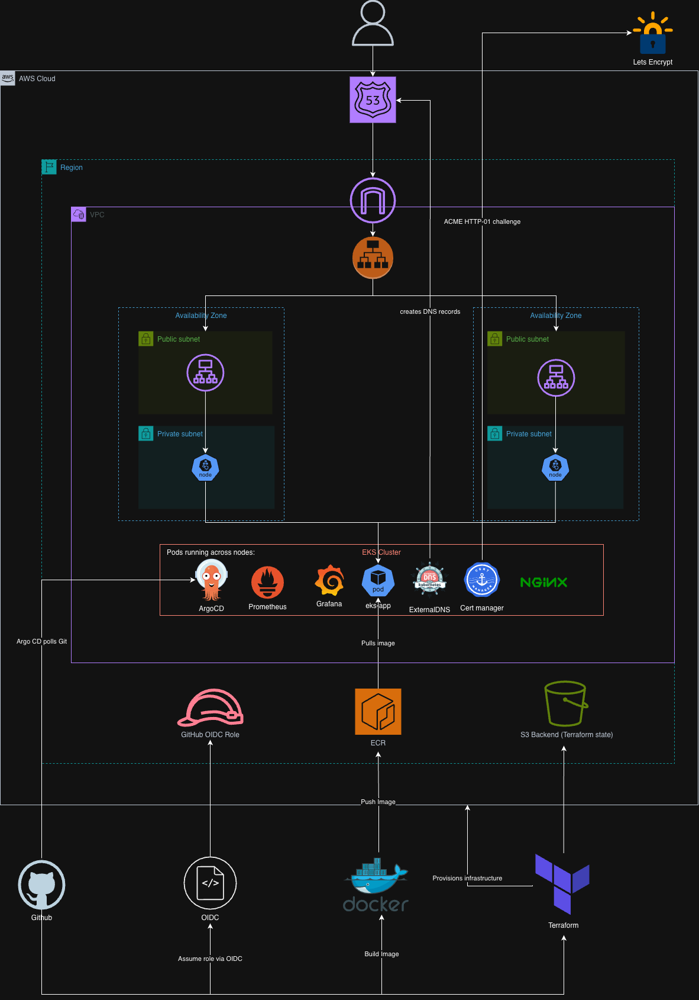

# eks-devops-platform

A production-style Kubernetes platform on AWS, demonstrating end-to-end DevOps practices: infrastructure as code, GitOps, automated CI/CD, security scanning, observability, and TLS automation.

The application itself (`eks-app`) is a minimal Node.js HTTP service that returns "Hello from EKS DevOps Platform", it exists as a deployment target. The main focus is the platform around it.


## What's in it

- **AWS Infrastructure** provisioned by Terraform (VPC, EKS, ECR, IAM, OIDC)
- **GitOps** with Argo CD, platform components and the app are all managed declaratively from Git
- **Automated deployments**, GitHub Actions builds images, scans them, pushes to ECR, and commits manifest updates back to Git for Argo CD to deploy
- **TLS** via cert-manager + Let's Encrypt (staging by default; switchable to production)
- **DNS automation** via ExternalDNS (Route 53 records created automatically from Ingress resources)
- **Monitoring** via Prometheus + Grafana (kube-prometheus-stack)
- **Security scanning**, Checkov on Terraform, Trivy on container images, on every push
- **Reproducible teardown**, destroy script handles AWS resources created by Kubernetes workloads (load balancers, DNS records, security groups)

## Architecture overview

**Terraform manages AWS. Argo CD manages Kubernetes.**

Terraform's job is to bring up the cluster and the resources around it (VPC, EKS, ECR, IAM roles). Its final act is to install Argo CD and apply one bootstrap Application. From there, Argo CD takes over and manages everything inside the cluster via GitOps.

```
Developer
    │ git push
    ▼
GitHub
    ├── app-ci.yml → build, scan, push to ECR, commit manifest update
    └── terraform-ci.yml → terraform plan/apply
    │
    ▼
Argo CD (in cluster)
    │ polls Git
    │ reconciles cluster to match Git
    ▼
EKS Cluster
    ├── ingress-nginx (managed by Argo CD)
    ├── cert-manager (managed by Argo CD)
    ├── ExternalDNS (managed by Argo CD)
    ├── kube-prometheus-stack (managed by Argo CD)
    └── eks-app - the application (managed by Argo CD)
```

## Architecture Diagram


## Workflows

### Application changes (the common case)

1. Developer pushes code changes to `app/` on `main`
2. GitHub Actions: builds Docker image, scans with Trivy, pushes to ECR (tagged with commit SHA)
3. GitHub Actions: updates `k8s/app/deployment.yaml` with the new image SHA and commits back to main
4. Argo CD detects the manifest change and rolls out the new image
5. Pods update; old pods terminate

### Infrastructure changes

1. Terraform code is modified in a PR
2. `terraform-ci.yml` runs `fmt`, `validate`, `plan`, and Checkov scan
3. After merge to main, apply is triggered via workflow_dispatch (manual button in GitHub Actions UI)

### Platform components (running continuously)

- **ingress-nginx** routes external traffic to services
- **cert-manager** watches Certificate resources and provisions TLS via Let's Encrypt
- **ExternalDNS** watches Ingress resources and updates Route 53 records
- **Prometheus + Grafana** collect and visualize cluster metrics

## Repository structure

```
.
├── app/                              Node.js application source
├── infra/                            Terraform IaC
│   ├── environments/dev/             Dev environment configuration
│   └── modules/                      Reusable modules (vpc, eks, ecr, argocd, etc.)
├── gitops/
│   ├── apps/                         Argo CD Application definitions
│   └── cert-manager-extras/          ClusterIssuer manifest
├── k8s/app/                          Application Kubernetes manifests
├── scripts/
│   ├── bootstrap-cluster.sh          Configure local kubeconfig after apply
│   └── destroy.sh                    Clean teardown (use instead of terraform destroy)
└── .github/workflows/
    ├── terraform-ci.yml              Terraform CI (plan, validate, Checkov)
    └── app-ci.yml                    App CI (build, Trivy, push, update manifest)
```

## Prerequisites

- AWS account with admin or PowerUser permissions
- Domain registered with Route 53 (this project uses `hasankadado.com`)
- GitHub repository (this one) with OIDC trust configured to your AWS account
- Locally installed: `terraform`, `aws-cli`, `kubectl`, `docker`

## Deployment

### 1. Bring up the infrastructure

```bash
cd infra/environments/dev
terraform init
terraform apply
```

Takes ~15-20 minutes. Most of that is the EKS control plane provisioning.

### 2. Configure local kubeconfig

```bash
./scripts/bootstrap-cluster.sh
```

This sets up `~/.kube/config` so `kubectl` talks to the new cluster.

### 3. Trigger the first app deployment

The cluster comes up with `eks-app` in a Degraded state because no image exists in ECR yet. To resolve, trigger the app pipeline:

- **Option A**: GitHub UI → Actions → "Build and Push App Image" → Run workflow
- **Option B**: Make any change to `app/` and push to `main`

The workflow builds and pushes the image to ECR, then commits a manifest update to main. Argo CD picks it up within ~3 minutes and deploys.

After ~5 more minutes (for cert provisioning and DNS):

```bash
curl -k https://eks.hasankadado.com
```

Should return `Hello from EKS DevOps Platform`. The `-k` flag is needed because the cert is from Let's Encrypt staging, see "Known Quirks" below.

## Health checks

```bash
# All Argo CD Applications (eks-app may be Degraded initially)
kubectl get application -n argocd

# All pods (excluding completed jobs)
kubectl get pods -A | grep -v "Running\|Completed"

# Ingress has an external hostname
kubectl get ingress

# DNS resolves
dig +short eks.hasankadado.com

# TLS cert is ready
kubectl get certificate

# Cluster issuer is ready
kubectl get clusterissuer
```

## Accessing Grafana

```bash
kubectl port-forward -n monitoring svc/kube-prometheus-stack-grafana 3000:80
```

Browser: `http://localhost:3000`
Username: `admin`
Password: `prom-operator`

~30 pre-built dashboards are available out of the box. Useful starting points:

- *Kubernetes / Compute Resources / Cluster* - overall cluster CPU/memory
- *Kubernetes / Compute Resources / Namespace (Pods)* - per-namespace resource usage
- *Node Exporter / Nodes* - host-level metrics for your worker nodes

## Teardown

**Use the destroy script, not `terraform destroy` directly.**

```bash
./scripts/destroy.sh
```

The script:

1. Deletes Kubernetes resources that own AWS infrastructure (Ingresses, LoadBalancer Services)
2. Polls AWS until the corresponding load balancers and orphaned security groups can be cleaned up
3. Runs `terraform destroy`

Running `terraform destroy` directly leaves orphaned AWS resources (load balancers, ENIs, security groups) that Terraform doesn't know about and can't clean up. This ordering avoids dependency issues where the VPC can't be destroyed because Kubernetes-created AWS resources are still using it.

## Security

- **GitHub Actions → AWS**: OIDC with trust scoped to this specific repo and `main` branch. No long-lived AWS access keys.
- **ExternalDNS → Route 53**: IRSA (IAM Roles for Service Accounts). The pod gets temporary credentials via the EKS OIDC provider. No AWS keys in the cluster.
- **ECR**: Image tags are immutable; built images cannot be overwritten.
- **CI scans**: Every Terraform push is scanned by Checkov; every container build is scanned by Trivy (CRITICAL/HIGH severities).
- **AWS budget alerts**: Configured at $30/month with notifications at 50%/80%/100%.

## Known quirks

- **`kube-prometheus-stack` CRDs are large**. Their OpenAPI schemas exceed Kubernetes' 256 KB annotation limit. Argo CD's syncOptions (`ServerSideApply=true`) handle this. If you upgrade the chart and CRDs hit this limit again, the workaround is to install CRDs manually via `kubectl apply --server-side`.

- **First-time TLS provisioning sometimes hangs on a stale DNS cache**. cert-manager runs a self-check before submitting the HTTP-01 challenge to Let's Encrypt, it tries to resolve the domain via CoreDNS to make sure the challenge URL will be reachable. If this self-check fires before ExternalDNS has propagated the Route 53 record, CoreDNS receives NXDOMAIN and caches it. The challenge then stays `pending` indefinitely, retrying against the cached negative answer. Workaround:

```bash
  kubectl rollout restart deployment coredns -n kube-system
  kubectl delete challenge --all
```

  The first command flushes CoreDNS's cache; the second forces cert-manager to retry the challenge with fresh DNS. Certificate becomes Ready within 1-2 minutes.

- **EKS API endpoint is publicly accessible**. For development convenience (running `kubectl` from a laptop without VPN). Protected by AWS IAM + Kubernetes RBAC. Not appropriate for production - restrict to specific CIDRs or move to a private endpoint behind a VPN/bastion.

- **TLS uses Let's Encrypt staging**. Avoids hitting production rate limits during development. Certs aren't browser-trusted, so `curl -k` or browser warning bypass is needed. To switch to production: edit `gitops/cert-manager-extras/cluster-issuer.yaml` to use the production ACME URL and update Ingress annotations to reference `letsencrypt-prod`.

- **Destroy script may leave orphaned security groups**. AWS sometimes doesn't fully clean up the SG that ingress-nginx's load balancer created. The script tries to handle this but occasionally fails; manual cleanup may be needed (see Teardown section).

- **Ingress is a Classic Load Balancer (CLB)**, not an NLB or ALB. This is because the in-tree Kubernetes AWS cloud provider creates CLBs by default. The AWS Load Balancer Controller would create modern NLBs/ALBs with proper finalizer-based cleanup, but adds setup complexity. Future improvement.

## Design decisions

- **CI commits manifest updates instead of using Argo CD Image Updater**. Image Updater would run in the cluster, watch ECR, and update manifests on its own. For a single-developer single-environment project, having CI do the commit is simpler and uses fewer moving parts. Image Updater would make more sense in a multi-environment setup where one image stream feeds multiple environments with different policies.

- **Single Terraform state**. For multi-engineer teams or environments with non-reproducible persistent state (databases, user data), Terraform state should be split into persistent and ephemeral concerns. Not necessary here since the only persistent resource is ECR, which holds reproducible artifacts that can be rebuilt by triggering the app pipeline.

- **Let's Encrypt staging by default**. Production certs are browser-trusted but rate-limited. For a project that gets destroyed and recreated frequently, staging avoids hitting limits and locking the account out for a week.

- **No persistent volumes for Prometheus**. Metrics history doesn't survive pod restarts. For a learning project this is acceptable; production should use a PersistentVolumeClaim backed by EBS.

## Future Work
- Switch to AWS Load Balancer Controller (NLB/ALB instead of CLB)
- Use Let's Encrypt production for browser-trusted certs
- Add persistent storage for Prometheus
- Separate Terraform state for persistent vs. ephemeral resources
- Multi-environment support (staging, prod)